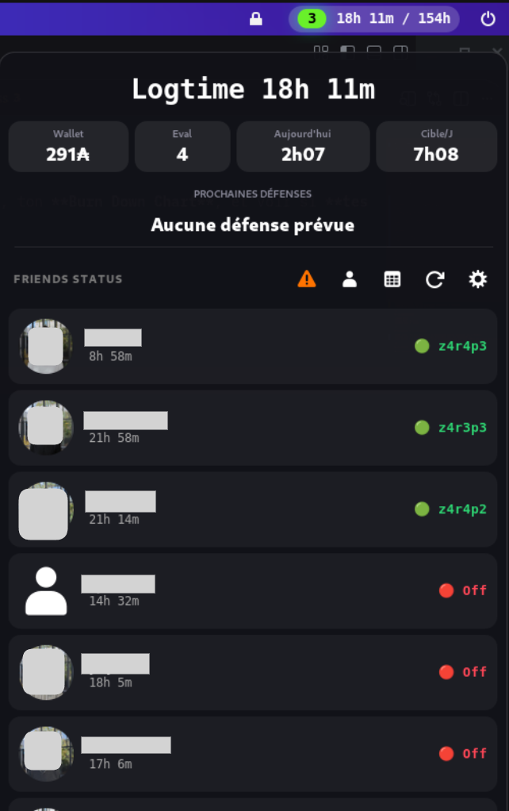

# 42 Dashboard Ultimate 🟢

Extension **GNOME Shell** ultra-rapide pour suivre en temps réel ton **Logtime**, ton **Wallet**, tes **évaluations**, ton **Burn Down Chart**, et voir si **tes amis sont présents au cluster**.



---

## ⚡ Installation rapide

1. Ouvre un terminal dans le dossier du projet  
2. Lance le script d’installation :

```bash
git clone https://github.com/BalkamFR/logtime.git logtime@42 && cd logtime@42 && chmod +x install.sh && ./install.sh

```

3. Redémarre GNOME Shell :
- `Alt + F2`
- tape `r`
- appuie sur **Entrée**

---

## 🔑 Configuration de l’API 42

Cette extension utilise deux méthodes de connexion pour contourner les limitations anti-triche de l'Intra 42.

---

### ÉTAPE 1 : Configuration de l’API 42 (Logtime, Amis, Wallet)
Tu dois créer une application OAuth sur l’Intra 42 pour obtenir tes accès.
1. Rends-toi sur : 👉 https://profile.intra.42.fr/oauth/applications/new
2. Remplis le formulaire comme suit :
    - Name : Gnome Dashboard
    - Redirect URI : http://localhost
    - Scopes : Coche uniquement public
3. Clique sur Submit.
4. Copie l'UID et le SECRET qui s'affichent.
5. Ouvre les Paramètres de l'extension (icône ⚙️ dans le menu de l'extension).
6. Colle tes clés et renseigne ton login 42 (ex: votre_login).


### ÉTAPE 2 : Connexion par Cookie (Prochaines Défenses)
L'API officielle restreint l'accès aux corrections futures pour les applications tierces. L'extension utilise donc un script Selenium pour récupérer ton cookie de session personnel.
1. Ouvre le menu de l'extension dans ta barre supérieure.
2. Dans la section des corrections, clique sur le bouton "🔑 Connexion (Cookie)".
3. Une fenêtre de navigateur surgit : connecte-toi normalement à l'Intra.
4. Une fois connecté, la fenêtre se ferme automatiquement et tes prochaines soutenances s'affichent !
    - Note : Le cookie est stocké localement et dure environ 2 mois.
---

## 📅 Fonctionnalités

### 🕒 Logtime
- Compteur précis en **temps réel**
- Affichage heures + minutes

### 🎯 Objectif mensuel
- Barre de progression configurable  
  _(ex : 150h / mois)_

### 📊 Statistiques
- Wallet
- Points de correction
- Niveau

### 👥 Amis
- Voir qui est **en ligne**
- Voir sur **quel poste**
- Logtime
- Accès rapide au profil Intra

### 📆 Calendrier partagé
- Clique sur un ami
- Consulte son **historique de logtime**

### 🛡️ Prochaines Défenses
- Alertes visuelles pour tes évaluations (Correcteur ou Corrigé).
- Affiche le projet, la date et l'heure.

---

## 🧩 Compatibilité

- GNOME Shell
- Linux (X11 / Wayland)
- Compte Intra 42 requis

---

## 🔒 Sécurité & confidentialité

- 100% Local : Tes clés API, logins et cookies sont stockés uniquement sur ta machine.
- Pas de Proxy : L'extension communique directement avec les serveurs de 42.
- Open Source : Tu peux vérifier le script capture_cookies.py pour voir comment tes données sont traitées.

---

## 📜 Licence

Projet personnel — usage libre pour les étudiants 42.
